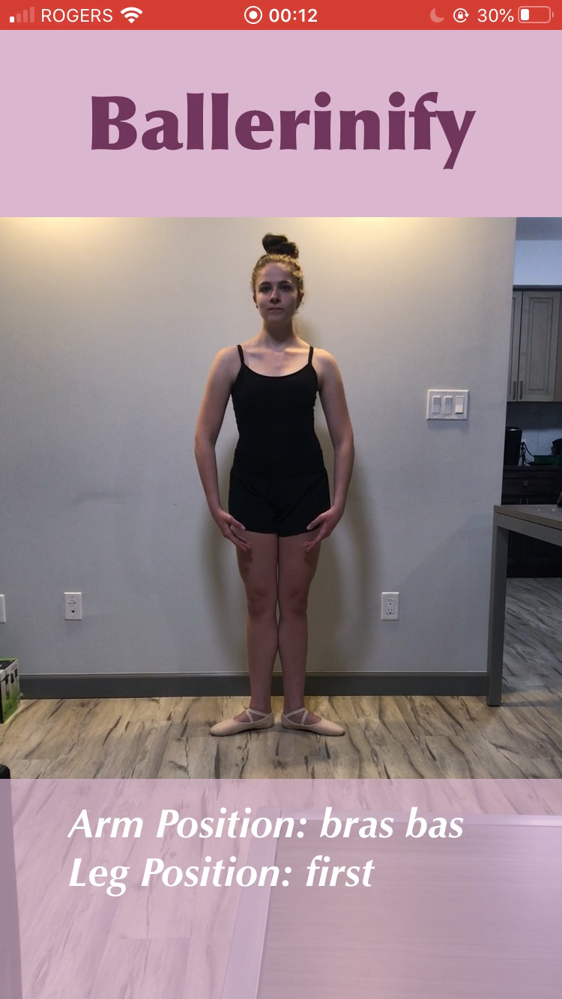
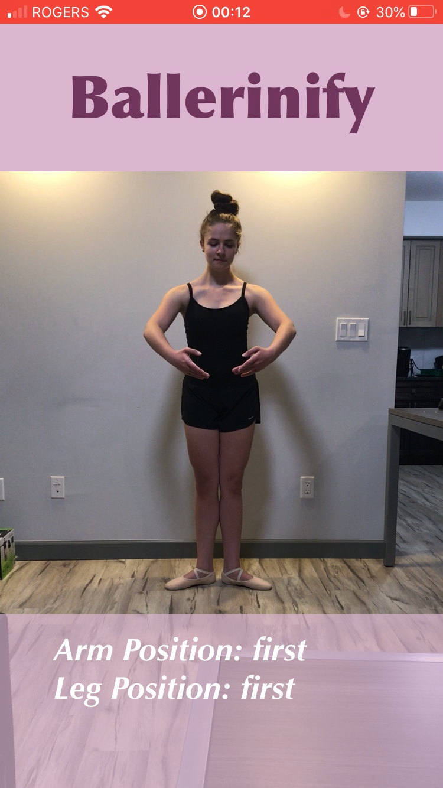
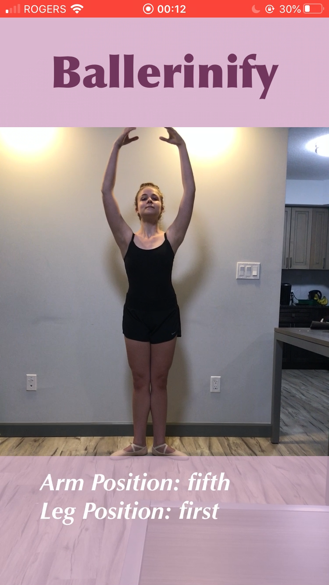
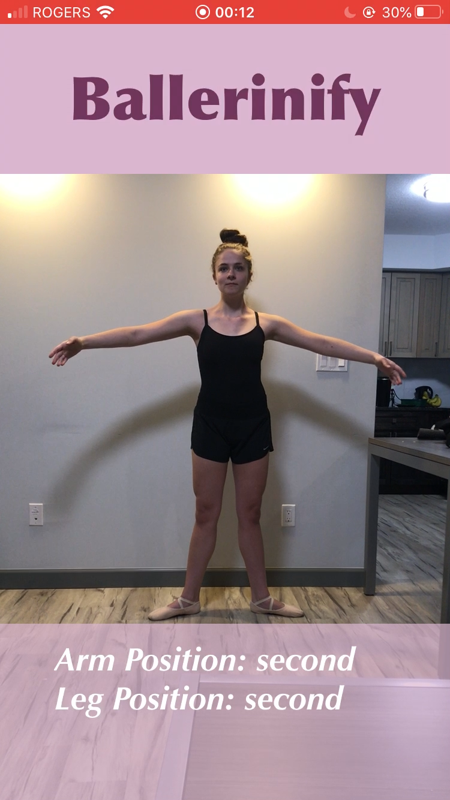
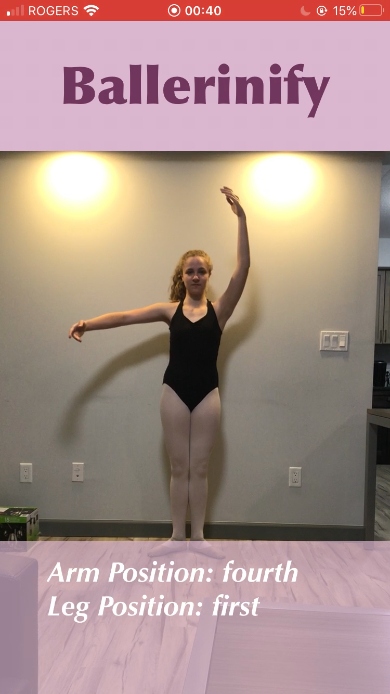
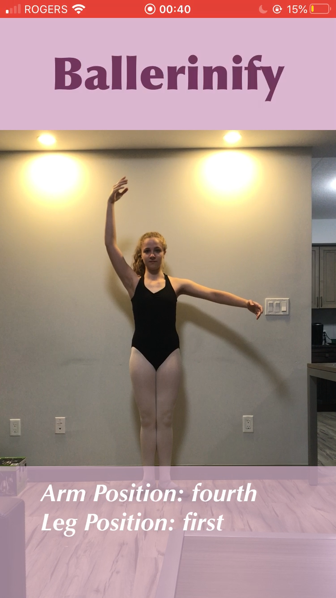
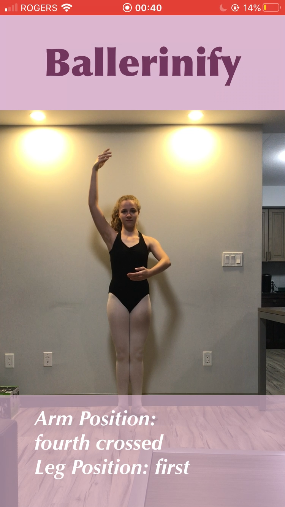
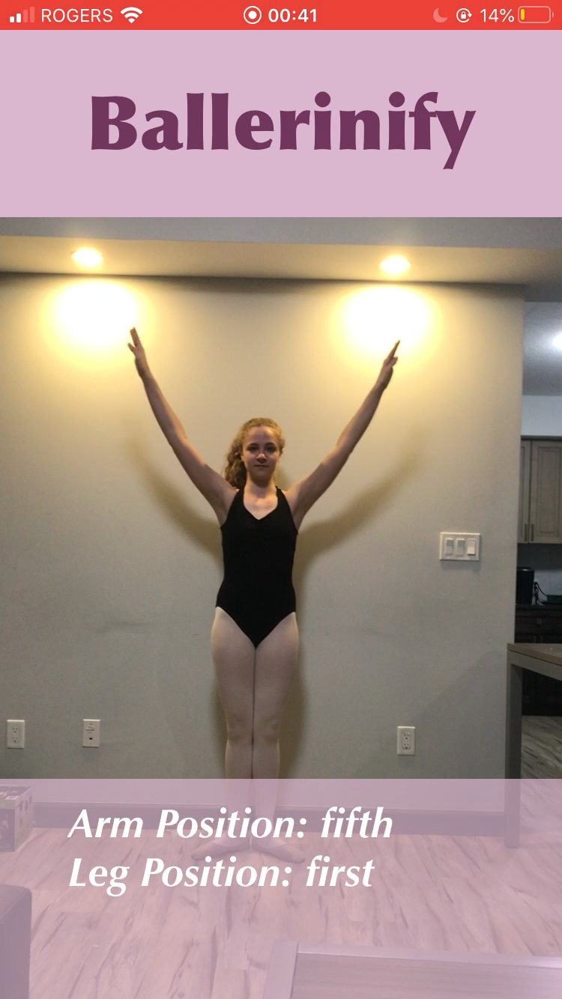

# Ballerinify

*Ballerinify* is an iOS app developed by two current Software Engineering students and former ballerinas.

*Ballerinify* watches the user in real-time to classify the dance position the user is in. The app uses machine learning to map key points on the user's body.

## Technologies Used
- **Swift**
  - **AVCaptureSession** from the **AVFoundation** swift library to manage camera feed input
  - **UIKit** to build the user interface components and control the code interaction
- **TensorFlow Lite PoseNet** model to identify key points on a body
- **CocoaPods** to manage project dependencies

Have any feedback? We would love to hear from you @ acdietz@uwaterloo.ca and kmdietz@uwaterloo.ca
